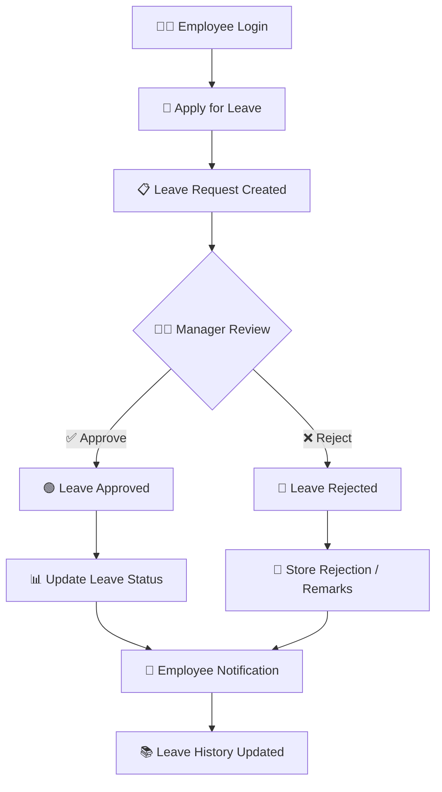

# 🏢 Employee Leave Management & Approval Portal

<p align="center">


</p>

<p align="center">
  
  
  
</p>

<p align="center">
  <b>🚀 A centralized platform for employees, managers and administrators to manage leave requests, approvals and leave records efficiently.</b>
</p>

<p align="center">
  <a href="#-overview">Overview</a> •
  <a href="#-features">Features</a> •
  <a href="#-workflow">Workflow</a> •
  <a href="#-technology-stack">Tech Stack</a> •
  <a href="#-installation">Installation</a> •
  <a href="#-screenshots">Screenshots</a>
</p>

---

## ✨ Overview

**Employee Leave Management & Approval Portal** is a web-based application designed to digitize and simplify the employee leave management process.

Instead of handling leave applications manually through emails, messages or paperwork, the platform provides a centralized system where employees can:

* 📝 Submit leave requests
* 📅 Select leave dates
* 📊 Track leave status
* 👀 View leave history
* ⏳ Monitor pending approvals

Managers / approvers can:

* 🔍 Review leave requests
* ✅ Approve requests
* ❌ Reject requests
* 💬 Provide remarks
* 📋 Track pending approvals

Administrators can manage the overall employee leave ecosystem.

> 🎯 **Goal:** Make the complete leave-request-to-approval process faster, transparent and easier to manage.

---

# 🎯 Problem Statement

Traditional employee leave processes can become difficult to manage when organizations rely on:

```text
Employee
   │
   ├── Email / Message
   │
   ├── Manager checks request
   │
   ├── HR updates records
   │
   └── Employee waits for confirmation
```

This can result in:

* ❌ Manual record keeping
* ❌ Delayed approvals
* ❌ Difficulty tracking leave history
* ❌ Communication gaps
* ❌ Lack of centralized information
* ❌ Increased administrative workload

### 💡 Solution

This project provides a centralized digital workflow:

```text
Employee
   │
   ▼
Submit Leave Request
   │
   ▼
Request Stored
   │
   ▼
Manager / Approver
   │
   ├───────────────┐
   ▼               ▼
 APPROVE         REJECT
   │               │
   ▼               ▼
Employee Updated  Employee Updated
```

---

# 🚀 Key Features

## 👨‍💼 Employee Module

### 📝 Leave Application

Employees can submit leave requests by providing the required information.

```text
Leave Type
    ↓
Start Date
    ↓
End Date
    ↓
Reason
    ↓
Submit Request
```

### 📊 Leave Dashboard

Employees can view important leave information from one place.

* Total leaves
* Used leaves
* Remaining leaves
* Pending requests
* Approved requests
* Rejected requests

### 📅 Leave History

Employees can track previously submitted requests and their current status.

| Status      | Meaning              |
| ----------- | -------------------- |
| 🟡 Pending  | Waiting for approval |
| 🟢 Approved | Leave approved       |
| 🔴 Rejected | Leave rejected       |

---

# 👨‍💼 Manager / Approver Module

Managers can review employee leave applications.

### Available Actions

```text
┌──────────────────────────────┐
│       Leave Request          │
├──────────────────────────────┤
│ Employee: John Doe           │
│ Leave Type: Casual Leave     │
│ From: 10/10/2026             │
│ To:   12/10/2026             │
│ Reason: Personal Work        │
├──────────────────────────────┤
│  ✅ APPROVE   ❌ REJECT       │
└──────────────────────────────┘
```

Managers can:

* 🔍 View request details
* ✅ Approve leave
* ❌ Reject leave
* 💬 Add remarks
* 📋 View pending requests
* 📊 Track approval activity

---

# 🛡️ Admin Module

The administration module provides centralized control over the system.

Possible administrative capabilities include:

* 👥 Employee management
* 🏢 Department management
* 📋 Leave management
* ⚙️ Leave configuration
* 📊 Leave monitoring
* 🔐 User/role management

---

# 🔄 Leave Approval Workflow

The application follows a structured workflow:



---

# 🏗️ System Architecture

```text
                    ┌─────────────────────┐
                    │      👤 USERS       │
                    └──────────┬──────────┘
                               │
                               ▼
                    ┌─────────────────────┐
                    │   🌐 FRONTEND UI    │
                    └──────────┬──────────┘
                               │
                               ▼
                    ┌─────────────────────┐
                    │    🔐 AUTHENTICATION │
                    └──────────┬──────────┘
                               │
                               ▼
                    ┌─────────────────────┐
                    │    ⚙️ APPLICATION    │
                    │       LOGIC         │
                    └──────────┬──────────┘
                               │
                    ┌──────────┴──────────┐
                    ▼                     ▼
             ┌──────────────┐      ┌──────────────┐
             │ 📋 LEAVE     │      │ 👥 EMPLOYEE  │
             │ MANAGEMENT   │      │ MANAGEMENT   │
             └──────┬───────┘      └──────┬───────┘
                    │                     │
                    └──────────┬──────────┘
                               ▼
                    ┌─────────────────────┐
                    │      🗄️ DATABASE     │
                    └─────────────────────┘
```

---

# 🛠️ Technology Stack

> ⚠️ Update the technologies below to match the exact implementation in this repository.

### Frontend

<p>


</p>

### Backend

<p>


</p>

### Database

<p>

</p>

### Tools

<p>


</p>

---

# 📂 Project Structure

```text
Employee-Leave-Management-Approval-Portal/
│
├── 📁 frontend/
│   ├── 📁 components/
│   ├── 📁 pages/
│   ├── 📁 assets/
│   └── ...
│
├── 📁 backend/
│   ├── 📁 controllers/
│   ├── 📁 routes/
│   ├── 📁 models/
│   ├── 📁 middleware/
│   └── ...
│
├── 📄 package.json
├── 📄 README.md
└── 📄 .gitignore
```

> Modify this structure according to your actual repository folders.

---

# ⚙️ Installation

## 1️⃣ Clone Repository

```bash
git clone https://github.com/AtharvaGahine11/Employee-Leave-Management-Approval-Portal.git
```

## 2️⃣ Navigate to Project

```bash
cd Employee-Leave-Management-Approval-Portal
```

## 3️⃣ Install Dependencies

If the project uses Node.js:

```bash
npm install
```

## 4️⃣ Configure Environment Variables

Create a `.env` file:

```env
PORT=5000
DATABASE_URL=your_database_url
JWT_SECRET=your_secret_key
```

> Add only the environment variables actually required by your implementation.

## 5️⃣ Start Development Server

```bash
npm run dev
```

or:

```bash
npm start
```

---

# 🖥️ Application Modules

```text
                    EMPLOYEE LEAVE PORTAL
                             │
          ┌──────────────────┼──────────────────┐
          │                  │                  │
          ▼                  ▼                  ▼
      👤 Employee        👨‍💼 Manager         🛡️ Admin
          │                  │                  │
          ▼                  ▼                  ▼
      Dashboard         Dashboard          Dashboard
          │                  │                  │
          ▼                  ▼                  ▼
      Apply Leave       Review Leave       Manage Users
          │                  │                  │
          ▼                  ▼                  ▼
      Leave History     Approve/Reject     Leave Policies
          │                  │                  │
          └──────────────────┼──────────────────┘
                             ▼
                       🗄️ DATABASE
```

---

# 🎨 UI / UX

The portal is designed around a clean and practical dashboard experience.

### Design Principles

* 🎯 Simple navigation
* 📱 Responsive interface
* 🧩 Reusable UI components
* 📊 Dashboard-based information
* 🔔 Clear status indicators
* ⚡ Fast interaction
* 🌓 Modern visual design

### Status Colors

```text
🟡 PENDING
    ↓
Waiting for manager action

🟢 APPROVED
    ↓
Leave successfully approved

🔴 REJECTED
    ↓
Leave request rejected
```

---

# 📸 Screenshots

> Add your actual screenshots here.

### 🔐 Login

<p align="center">
  
</p>

### 📊 Employee Dashboard

<p align="center">
  
</p>

### 📝 Apply Leave

<p align="center">
  
</p>

### 👨‍💼 Manager Dashboard

<p align="center">
  
</p>

### 📋 Leave Approval

<p align="center">
  
</p>

---

# 🎥 Demo

<p align="center">

<a href="YOUR_DEMO_LINK">


</a>

</p>

> Replace `YOUR_DEMO_LINK` with your deployed application URL.

---

# 🔐 Security Considerations

The application should follow secure development practices such as:

* 🔒 Password protection
* 🔑 Authentication
* 🛡️ Role-based access
* 🚫 Protected administrative routes
* 🔐 Environment variables for secrets
* 🧹 Input validation
* 🗄️ Secure database access

---

# 📊 Future Enhancements

The project can be extended with:

* 📧 Email notifications
* 🔔 Real-time notifications
* 📅 Company holiday calendar
* 📊 Advanced analytics
* 📈 Leave utilization charts
* 📄 PDF leave reports
* 📤 Excel / CSV export
* 🏢 Department-wise leave management
* 👨‍💼 Multi-level approval workflow
* 📱 Mobile application
* 🌙 Dark mode
* ☁️ Cloud deployment
* 🤖 AI-powered leave insights

---

# 🧠 Learning Outcomes

Through this project, the following concepts can be demonstrated:

```text
Frontend Development
        ↓
Responsive UI Design
        ↓
Authentication
        ↓
Role-Based Access
        ↓
Backend APIs
        ↓
Database Management
        ↓
CRUD Operations
        ↓
Approval Workflows
        ↓
Deployment
```

### Skills Demonstrated

* 🌐 Full-stack web development
* 🎨 UI/UX design
* 🔐 Authentication & authorization
* 🗄️ Database management
* 🔄 REST API integration
* 📊 Dashboard development
* 🧩 Modular application architecture
* 🛠️ Git & GitHub workflow

---

# 🚀 Deployment

The application can be deployed using platforms such as:

```text
Frontend
   ↓
Vercel / Netlify

Backend
   ↓
Render / Railway / AWS

Database
   ↓
MongoDB Atlas / PostgreSQL Cloud
```

> Configure deployment according to the actual technologies used in this repository.

---

# 🤝 Contributing

Contributions are welcome!

```bash
# Fork the repository

# Create a new branch
git checkout -b feature/your-feature

# Make your changes

# Commit
git commit -m "Add: new feature"

# Push
git push origin feature/your-feature
```

Then open a Pull Request.

---

# 🐛 Bug Reports & Suggestions

If you find a bug or have an idea for improvement:

1. Open an **Issue**
2. Explain the problem clearly
3. Add screenshots if possible
4. Mention steps to reproduce
5. Suggest a possible solution

---

# 👨‍💻 Developer

<p align="center">


</p>

<p align="center">

<a href="https://github.com/AtharvaGahine11">

</a>

</p>

---

# ⭐ Support

If you found this project useful or interesting, consider giving it a ⭐ on GitHub.

<p align="center">


</p>

---

# 📜 License

This project is developed for **educational and demonstration purposes**.

Add your preferred license here if the repository is intended for open-source distribution.

---

<p align="center">

### 💙 Built with passion by Atharva Gahine


</p>
